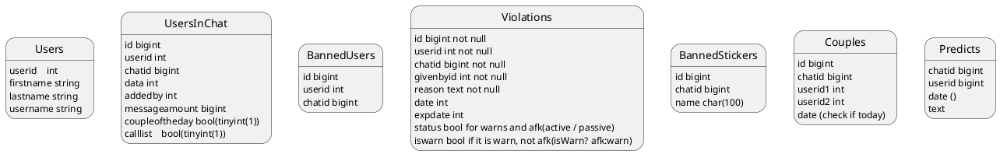

# Durbelik3 v1
## File structure

```
Durbelik3.1_bot
│   README.md
|   go.mod    
│
└───cmd
│   │
│   └───durbelik
│       │   main.go   
│   
└───internal
│   │   
│   └───configs
│   │   │   config.go
│   │   │   config.toml  
│   │   
│   └───graph
│   │   │   graph.go
│   │   │   graph.img
│   │   
│   └───text
│       │   inner_text.go
│       │   text.go
│
└───pkg
    │
    └───commands   
    │   │   commands.go
    │   │   privatemessages.go
    │   │   settings.go
    │   
    └───models
    │   │   models.go
    │   
    └───mongodatabase
    │   │   mongodatabase.go
    │   
    └───sqldatabase
    │   │   sqldatabase.go
    │   
    └───tools
        │   tools.go
```

# Config.go
>### What has it to do?
> 1. Parse toml file and do basic configuration.
> 2. Change configuration if needed.(add remove patrols, banned stickers, etc)
>   #### Toml file example
>   ``` TOML 
>   bot_token = "telegram_bot_token"
>   sql_token = "user:password@/Databasename"
>   
>   [[ChatConfigs]]
>   ID = chatid (int64)
>   title = chattitle (string)
>   username = chatusername (string)
>   type = chattype (string)
>   adminchats = [chatid1, chatid2] ([]int64)
>   patrulchats = [chatid1, chatid2] ([]int64)
>   language = "ua" or "en" (string)
>   bannedstickers = [] ([]string)
>   broadcast_key = "key" (string)
>   is_main = true (bool)
>   father_chat = chatid (int64)
>
>       [[ChatConfigs.admins]]
>       UserID = userid (int)
>       Firstname = firstname (string)
>       Username = username (string)
>       Lastname = lastname (string)
>
>       [[ChatConfigs.patruls]]
>       UserID = userid (int)
>       Firstname = firstname (string)
>       Username = username (string)
>       Lastname = lastname (string)
>
>       [[ChatConfigs.badwordsfilter]]
>       enabled = false (bool)
>       replace = false (bool)
>       react = false (bool)
>   ```
> ---
>   > #### Global PRIVATE variables
>   > config; tomlParsed(because init cant keep values)   
> ---
>   > #### MakeConfig() (*commandAPI, error)
>   >  1. Parse toml file to config struct. Create GLOBAL PRIVATE config value
>   > ```
>   > type config struct {
>	> BotToken    string               `toml:"bot_token"`
>	> SQLToken    string               `toml:"sql_token"`
>	> ChatConfigs []*models.ChatConfig `toml:"ChatConfigs"`
>   > }
>   > ```
>   > 2. Create commands.CommandAPI object and set values.
>   > 3. Create sqldatabase.Sqldatabase object and set values. Check it
>   > 4. Create NewBotApi. Give him next parameters:
>   >       * debug = false
>   > 5. Call updateUsers method.
>   > 6. Call updateConfiguration method.
>   > 7. Prefill models.BufferedChat.
>   > 8. Prefill commandAPI Buff and SQLDATABASE buff. 
>   > 9. Return CommandAPI and nil.
> ---
>   > #### updateUsers(*models.CommandAPI)
>   > 1. Get all users from table Users.
>   > 2. Get chatmember via commandAPI.Bot.GetChatMember
>   > 3. If user NOT isMember, or wasKicked or HasLeft update table UsersInChat. Set calllist and cotd to nil
>   > 4. Check for updates in table Users.
> ---
>   > #### updateConfiguration(*models.CommandAPI)
>   > 1. Use CommandAPI.getChat(chatConfig)
>   > 2. Compare title, username, admins, bannedstickers, broadcastkey. If not compare - update in config.ChatConfigs
>   >   > ### How to set broadcastkey?
>   >   > 1. Create map with fatherchatid : key
>   >   > 2. If isMain: check map and set needed key. If map[chatid] is nil, create key. If !isMain check map[fatherchat] is not nil. Else create key and write it to map.
>   > 3. Write new config.toml and return

# Main.go
> ### What has it to do?
> 1. Start some parallel functions and initiate some processors.
> 2. Process update types and send them to processors.
>   > #### Global variabes
>   > bot tgbotapi.BotInstance; PROCESSORS
> ---
>   > #### main()
>   > 1. Gets commandAPI from config.MakeConfig()
>   > 2. Sets global bot = commandAPI.Bot
>   > 3. Create UpdateConfig with offset 0 and set Timeout to 100
>   > 4. Inititate processors and parallel functions.
>   > 5. Create updates chat and start processing messages.
> ---
>   > #### botInit(*commands.CommandAPI)
>   > 1. init something
> ---
>   > #### checkAdmins(update) bool
>   > 1. If chat isMain just compare with admins. If not compare with fatherchat admins
> ---
>   > #### checkAdminsAndPatruls(update) bool
>   > 1. If chat isMain just compare with admins and patruls. If not compare with fatherchat admins and patruls
> ---
>   > ### Message Processing
>   > 1. Send to commands.Updates <- update
>   > 2. Ignore all edited messages 
>   > 3. Process callbackqueries (ONLY GLOBAL. IGNORE PRIVATE)
>   > 4. Process messages
>   >       * parallel If userleftchat set his calllist and cotd to false
>   >       * PROCESS ONLY GLOBAL MESSAGES. IF NOT GLOBAL CONTINUE
>   >       * parallel commandAPI.addCheckUser() is checking for user updates 
>   >       * Add chat to config if CommandAPI[chatID] is not exists
>   >       * Check if sticker is not banned (parallel)
>   >       * Delete all pinned messages
>   >       
>   >        

